# Credit Card Fraud Detection

Comparative analysis of machine learning models for detecting fraudulent credit card transactions. The dataset is severely imbalanced (0.17% fraud rate), so multiple rebalancing strategies are evaluated alongside each classifier. GPU acceleration is used throughout via cuML and XGBoost CUDA support.

---

## Dataset

- **Source:** [Kaggle — Credit Card Fraud Detection](https://www.kaggle.com/datasets/mlg-ulb/creditcardfraud)
- **Size:** 284,807 transactions — 492 fraudulent (0.17%)
- **Features:** 30 numerical features
  - `V1`–`V28`: PCA-transformed components (anonymized to protect sensitive information)
  - `Time`: seconds elapsed since the first transaction
  - `Amount`: transaction amount
- **Target:** `Class` — 0 (legitimate) or 1 (fraud)

### Data Characteristics

A 2D PCA projection shows that fraudulent transactions largely overlap with legitimate ones, with only a few clear outliers. A t-SNE visualization (8,000 transaction sample) confirms that fraud cases are scattered across the embedding with only small isolated clusters — indicating that simple linear decision boundaries are insufficient for this problem.

| PCA Projection | Explained Variance | t-SNE |
|---|---|---|
| 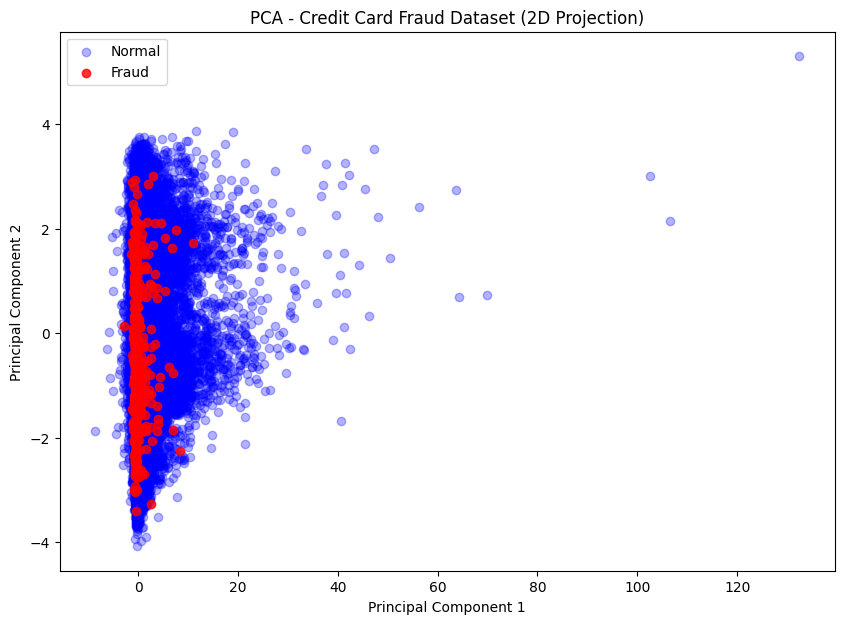 | 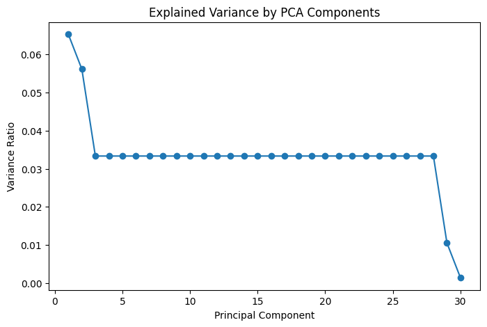 | 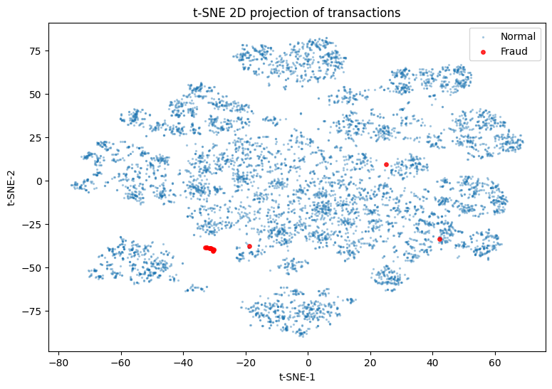 |

### Preprocessing

- No missing values; no imputation required
- `Amount` log-transformed to reduce right-skew from extreme outliers
- All features standardized with `StandardScaler` (zero mean, unit variance)
- 80/20 stratified train-test split to preserve the class ratio

---

## Models

| Notebook | Model | Acceleration |
|---|---|---|
| `LogisticRegression.ipynb` | Logistic Regression | cuML (GPU) |
| `RandomForrest.ipynb` | Random Forest | cuML (GPU) |
| `SVM.ipynb` | Support Vector Machine | cuML (GPU) |
| `XGBOOST.ipynb` | XGBoost | CUDA (`tree_method="hist"`) |

---

## Class Imbalance Strategies

Each model is trained and evaluated under four conditions:

| Strategy | Description |
|---|---|
| **None** | No resampling; baseline |
| **Class Weight (CW)** | Higher loss penalty assigned to the minority (fraud) class |
| **SMOTE** | Synthetic minority samples generated within training folds |
| **SMOTE + CW** | Combined oversampling and cost-sensitive weighting |

---

## Hyperparameter Tuning

Tuning was performed using `GridSearchCV` (LR) and `RandomizedSearchCV` (RF, XGB, SVM) with 5-fold stratified cross-validation, optimizing for **PR-AUC** to reflect minority class performance.

| Model | Strategy | Best Parameters | CV ROC-AUC |
|---|---|---|---|
| LR | None | C=1e-4, intercept=False, tol=0.001, max_iter=500 | 0.980 |
| LR | CW | C=0.1, intercept=True, tol=1e-4, max_iter=500 | 0.977 |
| LR | SMOTE | C=100, intercept=True, tol=0.001, max_iter=500 | 0.998 |
| LR | SMOTE+CW | C=100, intercept=True, tol=0.001, max_iter=500 | 0.998 |
| RF | None | n_est=800, depth=8, bins=256, bootstrap=False, entropy | 0.984 |
| RF | CW | n_est=600, depth=12, bins=64, bootstrap=False, entropy | 0.983 |
| RF | SMOTE | n_est=800, depth=20, bins=256, bootstrap=False, entropy | 1.000 |
| RF | SMOTE+CW | n_est=800, depth=24, bins=64, bootstrap=False, entropy | 1.000 |
| XGB | None | n_est=1200, depth=8, lr=0.03, subsample=0.8, colsample=1.0, min_child=20, λ=1.0, α=0.1, γ=0.5 | 0.986 |
| XGB | CW | n_est=1200, depth=8, lr=0.03, subsample=0.8, colsample=1.0, min_child=20, λ=1.0, α=0.1, γ=0.5 | 0.986 |
| XGB | SMOTE | n_est=1200, depth=5, lr=0.1, subsample=1.0, colsample=0.8, min_child=1, λ=1.0, α=0.1, γ=0.0 | 1.000 |
| XGB | SMOTE+CW | n_est=1200, depth=5, lr=0.1, subsample=1.0, colsample=0.8, min_child=1, λ=1.0, α=0.1, γ=0.0 | 1.000 |
| SVM | None | C=0.1, kernel=linear, γ=scale, class_weight=balanced | 0.983 |
| SVM | CW | C=0.1, kernel=linear, γ=scale, class_weight=balanced | 0.983 |
| SVM | SMOTE | C=10, kernel=rbf, γ=scale, class_weight=balanced | 1.000 |
| SVM | SMOTE+CW | C=10, kernel=rbf, γ=scale, class_weight=None | 1.000 |

---

## Results (Test Set)

### AUC and Confusion Matrix

| Model | PR-AUC | ROC-AUC | TP | FP | TN | FN |
|---|---|---|---|---|---|---|
| LR (None) | 0.715 | 0.984 | 98 | 56,864 | 0 | 0 |
| LR (CW) | 0.484 | 0.975 | 90 | 2,696 | 54,168 | 8 |
| LR (SMOTE) | 0.800 | 0.977 | 89 | 1,111 | 55,753 | 9 |
| LR (SMOTE+CW) | 0.800 | 0.977 | 89 | 1,111 | 55,753 | 9 |
| RF (None) | 0.883 | 0.981 | 85 | 14 | 56,850 | 13 |
| RF (CW) | 0.887 | 0.984 | 83 | 11 | 56,853 | 15 |
| RF (SMOTE) | 0.881 | 0.981 | 86 | 30 | 56,834 | 12 |
| RF (SMOTE+CW) | 0.885 | 0.976 | 86 | 28 | 56,836 | 12 |
| XGB (None) | 0.878 | 0.978 | 86 | 22 | 56,842 | 12 |
| XGB (CW) | 0.878 | 0.978 | 86 | 22 | 56,842 | 12 |
| **XGB (SMOTE)** | **0.879** | **0.985** | **85** | **22** | **56,842** | **13** |
| **XGB (SMOTE+CW)** | **0.879** | **0.985** | **85** | **22** | **56,842** | **13** |
| SVM (None) | 0.390 | 0.973 | 97 | 40,257 | 16,607 | 1 |
| SVM (CW) | 0.738 | 0.975 | 98 | 56,487 | 377 | 0 |
| SVM (SMOTE) | 0.735 | 0.977 | 98 | 55,495 | 1,369 | 0 |
| SVM (SMOTE+CW) | 0.697 | 0.968 | 98 | 48,468 | 8,396 | 0 |

### Precision, Recall, and F1

| Model | Precision (%) | Recall (%) | F1 | Threshold |
|---|---|---|---|---|
| LR (None) | 0.17 | 100.0 | 0.00 | 0.916 |
| LR (CW) | 3.23 | 91.8 | 0.06 | 0.991 |
| LR (SMOTE) | 7.42 | 90.8 | 0.14 | 1.000 |
| LR (SMOTE+CW) | 7.42 | 90.8 | 0.14 | 1.000 |
| RF (None) | 85.9 | 86.7 | 0.86 | 0.489 |
| RF (CW) | 88.3 | 84.7 | 0.87 | 0.481 |
| RF (SMOTE) | 74.1 | 87.8 | 0.80 | 0.784 |
| RF (SMOTE+CW) | 75.4 | 87.8 | 0.81 | 0.746 |
| XGB (None) | 79.6 | 87.8 | 0.84 | 0.996 |
| XGB (CW) | 79.6 | 87.8 | 0.84 | 0.996 |
| **XGB (SMOTE)** | **79.4** | **86.7** | **0.89** | **0.925** |
| **XGB (SMOTE+CW)** | **79.4** | **86.7** | **0.89** | **0.925** |
| SVM (None) | 0.24 | 99.0 | 0.00 | 0.848 |
| SVM (CW) | 0.17 | 100.0 | 0.00 | 0.521 |
| SVM (SMOTE) | 0.18 | 100.0 | 0.00 | 0.467 |
| SVM (SMOTE+CW) | 0.20 | 100.0 | 0.00 | 0.649 |

> **Bold rows indicate the selected best model.** PR-AUC is the primary metric due to class imbalance — accuracy is misleading when 99.83% of transactions are legitimate.

---

---

## ROC and Precision-Recall Curves

<details open>
<summary><strong>Logistic Regression</strong></summary>

| Strategy | ROC Curve | PR Curve |
|---|---|---|
| None | 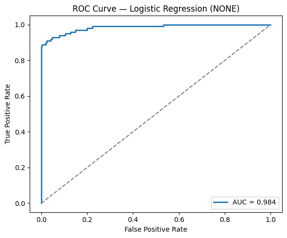 | 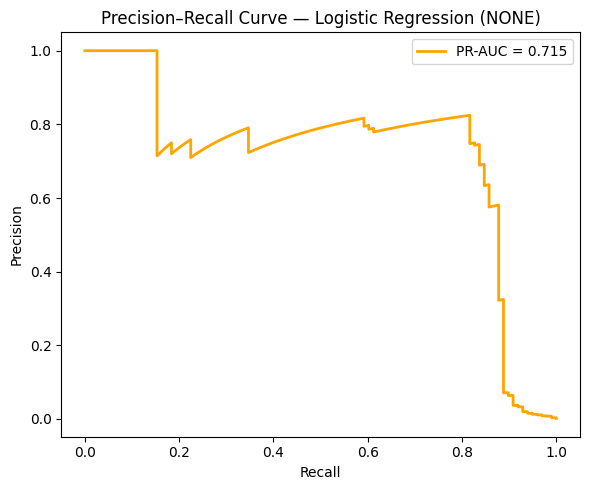 |
| Class Weight | 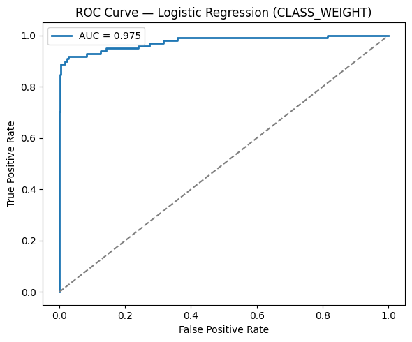 | 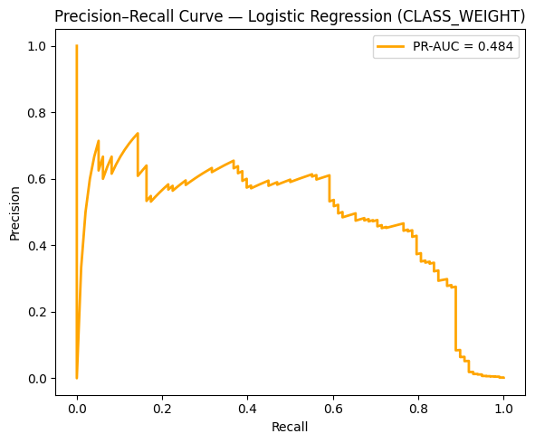 |
| SMOTE | 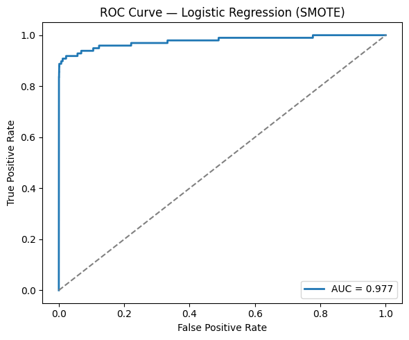 | 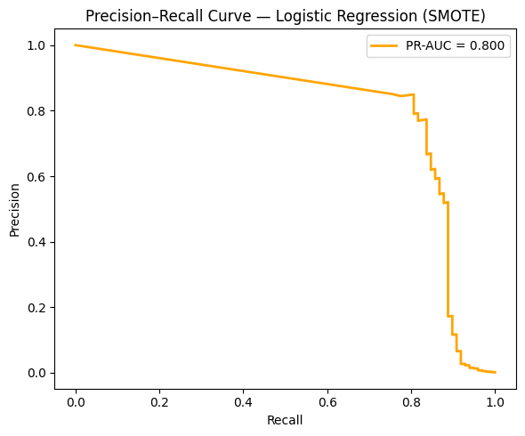 |
| SMOTE + CW | 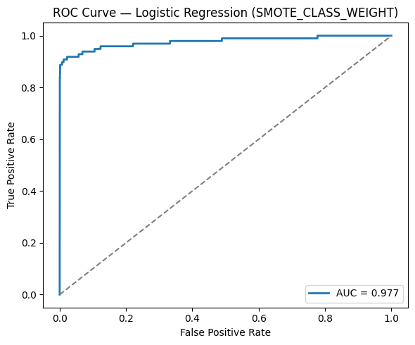 | 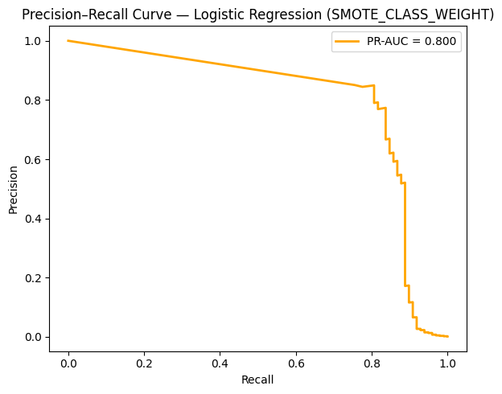 |

</details>

<details open>
<summary><strong>Random Forest</strong></summary>

| Strategy | ROC Curve | PR Curve |
|---|---|---|
| None | 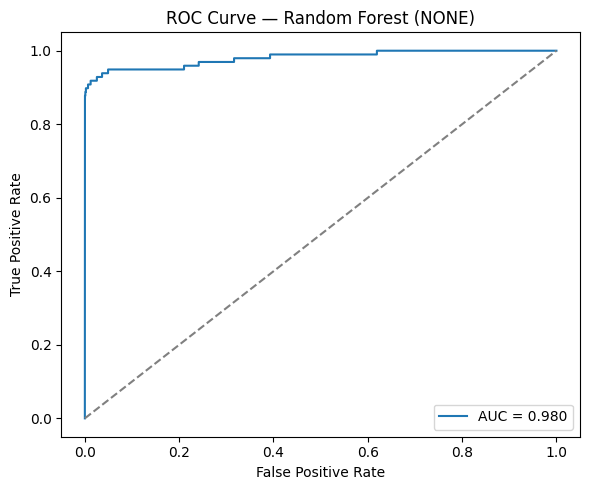 | 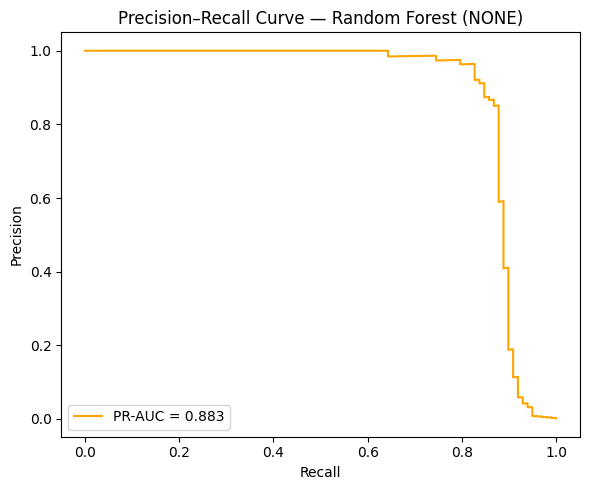 |
| Class Weight | 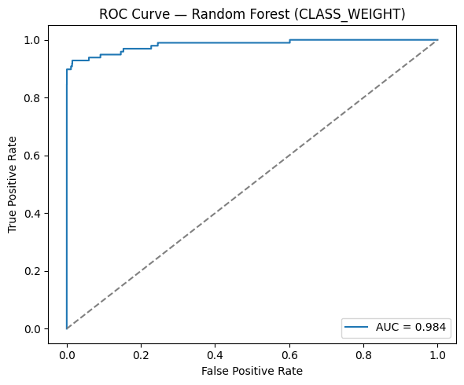 | 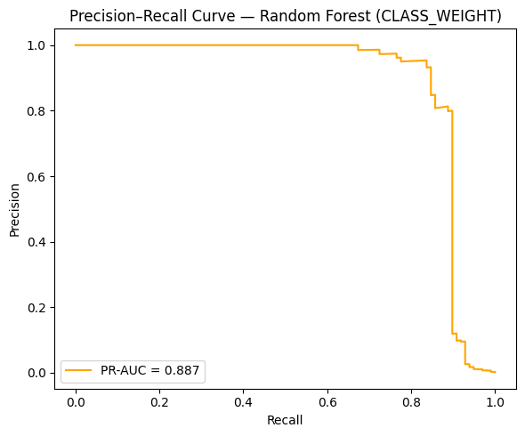 |
| SMOTE |  | 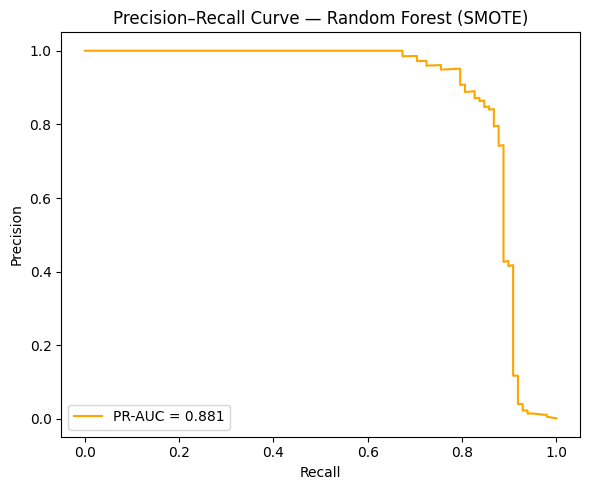 |
| SMOTE + CW | 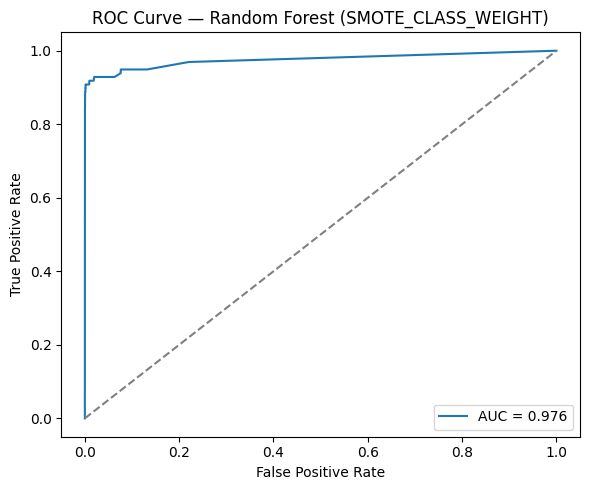 | 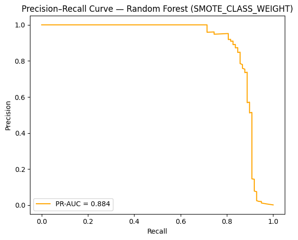 |

</details>

<details open>
<summary><strong>XGBoost</strong></summary>

| Strategy | ROC Curve | PR Curve |
|---|---|---|
| None | 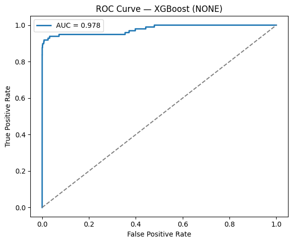 | 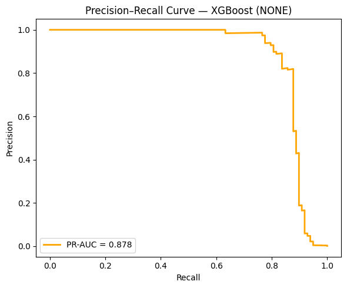 |
| Class Weight | 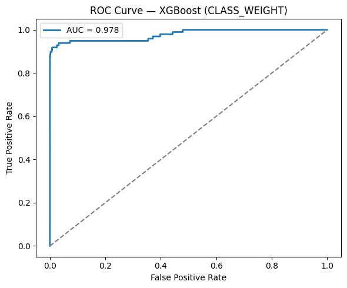 | 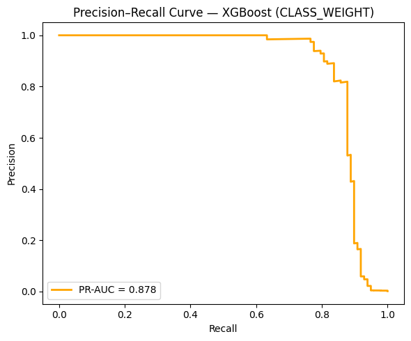 |
| SMOTE | 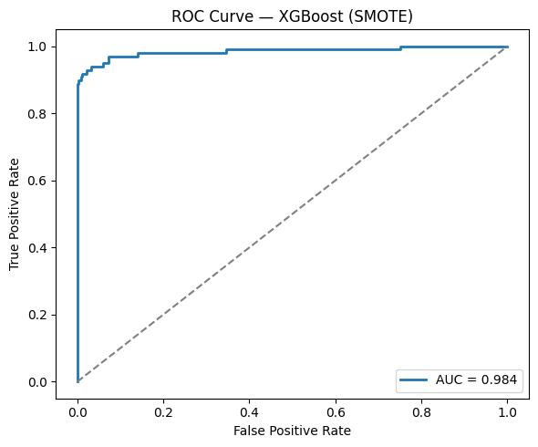 | 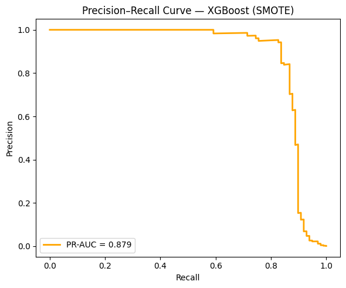 |
| SMOTE + CW | 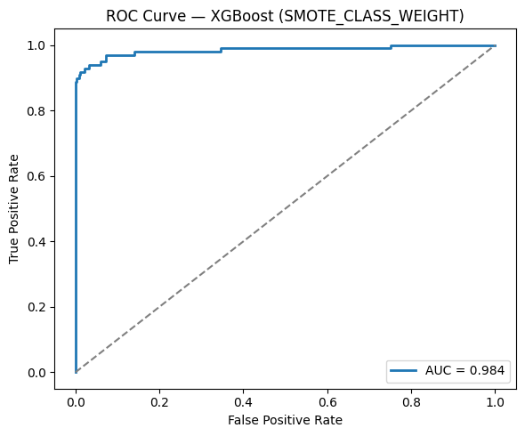 | 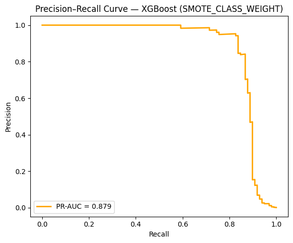 |

</details>

<details open>
<summary><strong>Support Vector Machine</strong></summary>

| Strategy | ROC Curve | PR Curve |
|---|---|---|
| None | 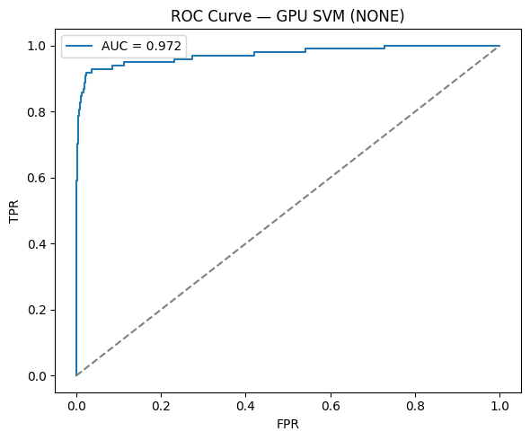 | 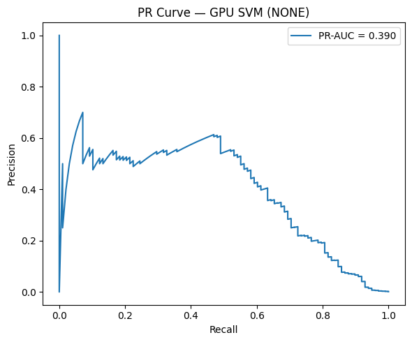 |
| Class Weight | 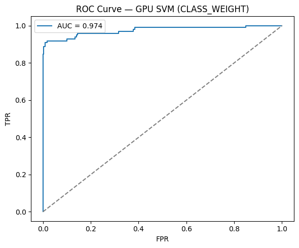 | 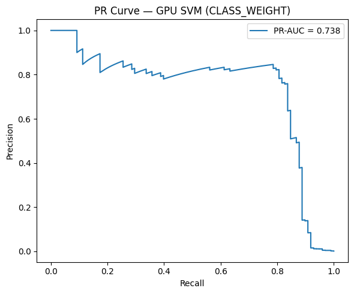 |
| SMOTE | 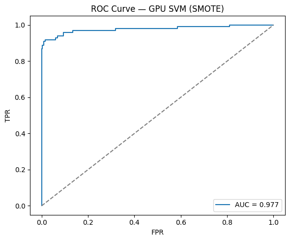 | 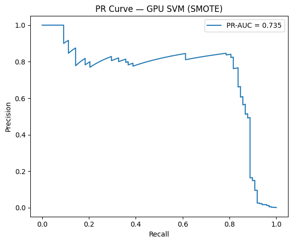 |
| SMOTE + CW | 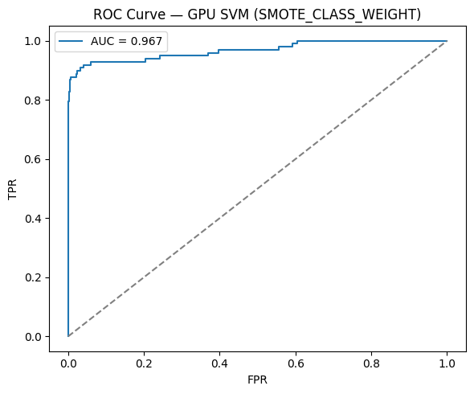 | 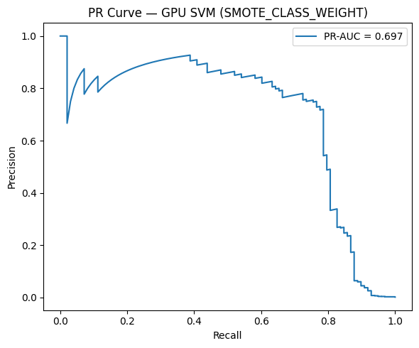 |

</details>

---

## Key Findings

- **Tree-based models (RF, XGBoost) substantially outperform LR and SVM** in both PR-AUC and F1, due to their ability to capture non-linear decision boundaries in the PCA-transformed feature space.
- **SVM achieves near-perfect recall but near-zero precision** without careful threshold tuning — it flags almost everything as fraud, making it impractical without further calibration.
- **LR (None) classifies every transaction as fraud** (TP=98, TN=0), confirming that accuracy is a useless metric here.
- **SMOTE + Class Weight on XGBoost produces identical results to SMOTE alone**: XGBoost's gradient boosting internally re-weights instances, so adding explicit class weighting after SMOTE does not change the effective loss gradients.
- **Entropy split criterion consistently outperformed Gini** across all Random Forest configurations.
- **Optimal decision threshold was tuned per model** (ranging from 0.467 to 0.996) rather than using the default 0.5, significantly improving F1 scores.
- All models evaluated with **StratifiedKFold cross-validation (3–5 folds)** to prevent data leakage from SMOTE into validation folds.

---

## Requirements

```
Python 3.12
scikit-learn
imbalanced-learn
xgboost
pandas
numpy
matplotlib
cuML (RAPIDS) — for GPU-accelerated LR, RF, SVM
```

GPU training was conducted with CUDA acceleration, significantly reducing computation time for ensemble and SVM models under repeated cross-validation.
